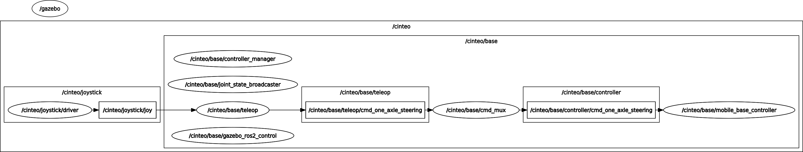

# cinteo_bringup

## 1) Overview

`cinteo_bringup` connects the Cinteo description, hardware, simulation and teleoperation packages to the generic `romea_mobile_base_meta_bringup` workflow.

It provides:

* robot-specific generation functions for configuration, URDF and `ros2_control` descriptions;
* launch files for live control, Gazebo simulation and teleoperation;
* controller manager and mobile base controller parameter files;

The Cinteo mobile base uses the `1FAS2RWD` architecture and the `one_axle_steering` command type.


## 2) Generated artifacts

The Python module `cinteo_bringup` delegates most generation work to `cinteo_description` and adds bringup-specific configuration such as the controller manager parameter file.

It provides the functions expected by `romea_mobile_base_meta_bringup`:

| Function | Purpose |
|---|---|
| `get_configuration()` | returns the compact mobile base configuration |
| `generate_configuration_file(extended)` | generates the mobile base configuration file |
| `generate_urdf_description(prefix, mode, base_name, ros_prefix)` | generates the Cinteo URDF description |
| `generate_ros2_control_description(prefix, mode, base_name)` | generates the Cinteo `ros2_control` description |

The executable scripts in `scripts/` expose these functions from the command line.

The configuration generator writes the compact `1FAS2RWD` mobile base configuration used by controllers, teleoperation and launch files. It is derived from `cinteo_description/config/cinteo.yaml`.

```bash
ros2 run cinteo_bringup generate_configuration_file.py \
  extended:false
```

The URDF generator writes the Cinteo robot description. It contains the `1FAS2RWD` link and joint structure, inertial data, collision geometry, visual meshes and the simulator plugin block when a simulation mode is selected.

```bash
ros2 run cinteo_bringup generate_urdf_description.py \
  robot_namespace:cinteo \
  base_name:base \
  mode:simulation_gazebo
```

The `ros2_control` generator writes the hardware description consumed by `controller_manager`. It declares the hardware plugin selected by the mode, the geometric hardware parameters and the command/state interfaces for the front axle steering joint and rear wheel spinning joints.

```bash
ros2 run cinteo_bringup generate_ros2_control_description.py \
  robot_namespace:cinteo \
  base_name:base \
  mode:live
```

## 3) Launch files

### 3.1) Base launch

`launch/cinteo_base.launch.py` starts the Cinteo mobile base control stack.

It:

* receives the generated robot URDF and `ros2_control` description from the meta-bringup launch context;
* starts `controller_manager/ros2_control_node` in non-Gazebo modes;
* loads `joint_state_broadcaster`;
* loads `mobile_base_controller` using `romea_mobile_base_controllers/MobileBaseController1FAS2RWD`;
* starts `romea_cmd_mux` and remaps its output to `controller/cmd_one_axle_steering`.

Main launch arguments are:

| Argument | Description |
|---|---|
| `mode` | execution mode, such as `live`, `simulation_gazebo` or `simulation_gazebo_classic` |
| `robot_namespace` | namespace of the robot |
| `base_name` | namespace of the mobile base, usually `base` |

### 3.2) Teleoperation launch

`launch/cinteo_teleop.launch.py` starts the mobile base teleoperation stack through `romea_mobile_base_teleop`.

It uses:

* the Cinteo robot configuration from `cinteo_description/config/cinteo.yaml`;
* the joystick configuration file, usually selected from the `config/` directory of `romea_joystick_utils` according to the joystick type;
* the teleoperation configuration from `cinteo_description/config/teleop.yaml` by default.

The teleoperation node publishes `romea_mobile_base_msgs/OneAxleSteeringCommand`, consistent with the `1FAS2RWD` controller command type.

To move the robot, the operator must hold either the slow mode or turbo mode button. The joystick axes then command the longitudinal speed and the front axle steering angle.

Main launch arguments are:

| Argument | Description |
|---|---|
| `mode` | execution mode, used to configure simulation time |
| `joystick_topic` | joystick `sensor_msgs/msg/Joy` topic |
| `joystick_configuration_file_path` | joystick configuration file, usually selected from `romea_joystick_utils/config/` |
| `teleop_configuration_file_path` | teleoperation configuration file, defaulting to `cinteo_description/config/teleop.yaml` |


### 3.3) Gazebo launch

`launch/cinteo_gazebo.launch.py` starts a Gazebo or Gazebo Classic simulation and spawns the Cinteo entity from the generated URDF.

It supports:

* `simulation_gazebo`, using `ros_gz_sim` and `gz_ros2_control`;
* `simulation_gazebo_classic`, using `gazebo_ros` and `gazebo_ros2_control`.

The `ros2_control` hardware plugin used in simulation is selected by `cinteo_description` from the generated `mode`.

Main launch arguments are:

| Argument | Description |
|---|---|
| `mode` | simulation mode, usually `simulation_gazebo` or `simulation_gazebo_classic` |
| `robot_namespace` | namespace of the robot and simulation entity |
| `base_name` | namespace of the mobile base, usually `base` |

### 3.4) Test launch

`launch/cinteo_test.launch.py` starts a compact test setup with:

* the Cinteo simulation when the selected mode contains `simulation`;
* the Cinteo base launch;
* the Cinteo teleoperation launch;
* a joystick node using the selected joystick model.

In simulation mode, the controller manager is provided by the Gazebo integration. In live mode, the base launch starts the standard `controller_manager/ros2_control_node`.

Main launch arguments are:

| Argument | Description |
|---|---|
| `mode` | execution mode, usually `simulation_gazebo` for this test setup |
| `joystick_model` | joystick model used to select the default joystick configuration, such as `microsoft_xbox` or `sony_dualshock4` |

The following diagram gives an overview of the control pipeline started by this test launch file.



## 4) Configuration files

The `config/` directory contains:

| File | Purpose |
|---|---|
| `controller_manager.yaml` | declares `joint_state_broadcaster` and `MobileBaseController1FAS2RWD` |
| `mobile_base_controller.yaml` | provides common runtime parameters for the mobile base controller |

The robot geometry, inertia, joint names and teleoperation defaults are stored in `cinteo_description/config/`.

## 5) Relation with the meta-bringup workflow

`cinteo_bringup` is the robot-specific extension used when a mobile base meta-description selects:

```yaml
configuration:
  manufacturer: xlim
  model: cinteo
  version: ""
```

In that workflow:

* `romea_mobile_base_meta_bringup` reads the mobile base meta-description;
* `cinteo_bringup` generates Cinteo-specific configuration, URDF, `ros2_control` and launch artifacts;
* `cinteo_description` provides the concrete robot model;
* `cinteo_hardware` is used in `live` mode;
* `romea_mobile_base_gazebo` or `romea_mobile_base_gazebo_classic` is used in Gazebo simulation modes;
* `romea_mobile_base_teleop` starts the matching one-axle steering teleoperation node.
